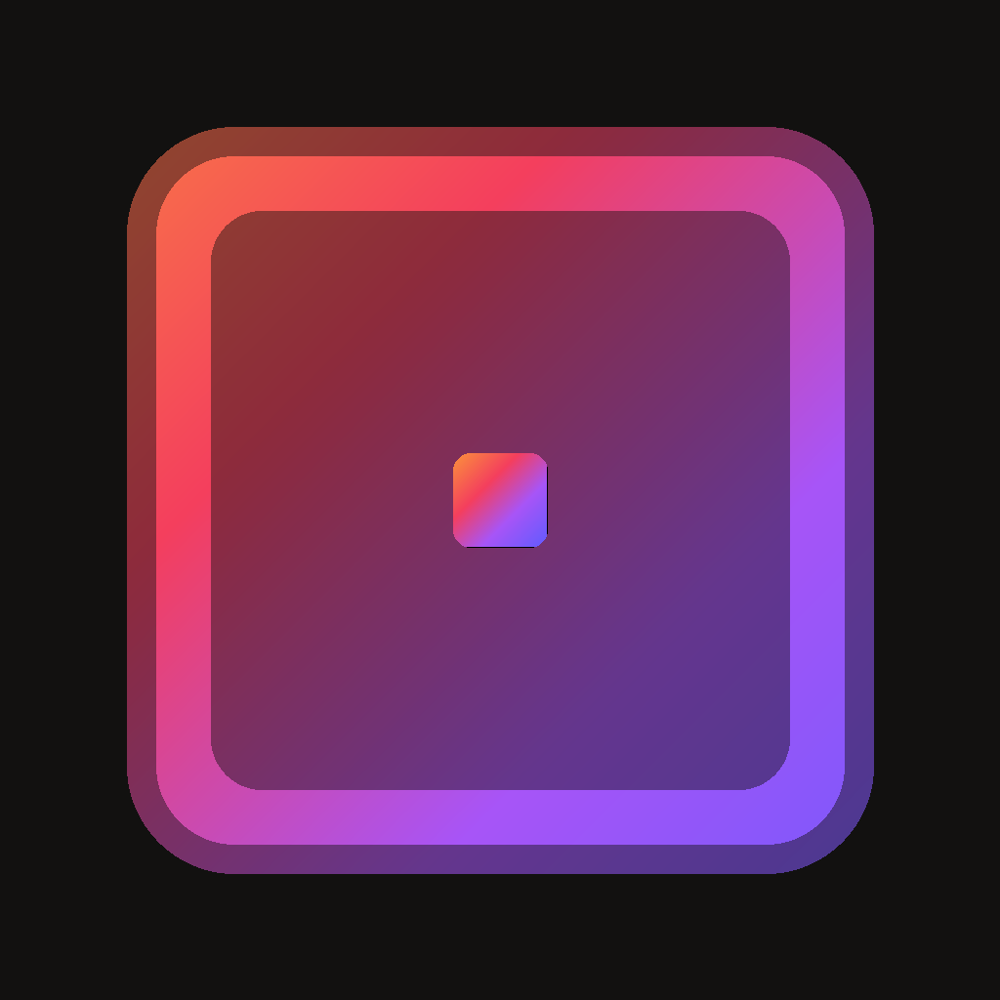

<p align="center">
  
</p>

<h1 align="center">arenaframe</h1>
<p align="center"><strong>your monitor. a channel.</strong></p>

<p align="center">
  
  
  
  
  
</p>

<br />

A minimal macOS menu bar app that turns any display into a living window into your [Are.na](https://are.na) collections. Built entirely with the public Are.na v3 API — no account or OAuth required for public channels.

Free and open source.

---

## features

- fullscreen frame at screen-saver level — sits above everything
- global hotkey `⌘⇧A` to open/close — no Accessibility permission needed
- **fit modes** — contain (letterboxed), cover (fill + crop), blur fill (blurred background)
- **transitions** — crossfade, ken burns (slow pan + zoom), instant
- quality filter — skips low-res images on large displays (configurable max upscale)
- cursor auto-hides after 1 second, reappears on movement
- label overlay: never / on hover / always
- minimal clock overlay (HH:MM)
- launch at login
- SHA-256 disk cache — images persist across sessions

## install

1. download `arenaframe.dmg` from [releases](../../releases/latest)
2. open the DMG, drag `arenaframe` → Applications
3. right-click → Open on first launch (ad-hoc signed — no notarization yet)
4. click the `⊡` icon in your menu bar → add a public Are.na channel slug

## usage

| key | action |
|-----|--------|
| `⌘⇧A` | open / close frame |
| `← →` | prev / next block |
| `space` | pause / resume slideshow |
| `esc` / `q` | close frame |

Add any public Are.na channel by slug (e.g. `lme-colour`) or URL (`are.na/lima-erba/lme-colour`). The app validates the channel and fetches all blocks.

## build from source

**requirements:** macOS 14+, Xcode 15+, [xcodegen](https://github.com/yonaskolb/XcodeGen)

```bash
git clone https://github.com/howwohmm/arenaframe
cd arenaframe
xcodegen generate
open ArenaFrame.xcodeproj
```

Set your development team in `project.yml` under `DEVELOPMENT_TEAM`.

## settings

| setting | options |
|---------|---------|
| interval | 3 – 120 seconds |
| order | random · newest · oldest |
| fit mode | contain · cover · blur fill |
| transition | crossfade · ken burns · instant |
| label | never · on hover · always |
| quality filter | max upscale multiplier (1× – 4×) |
| clock overlay | HH:MM in corner |
| launch at login | via ServiceManagement |

## architecture

```
Sources/ArenaFrame/
├── ArenaFrameApp.swift          — entry point, NSStatusItem + NSPopover
├── AppState.swift               — @Observable shared state, UserDefaults persistence
├── HotkeyManager.swift          — Carbon RegisterEventHotKey (global, no permissions)
├── Arena/
│   ├── ArenaClient.swift        — actor-based API client, SHA-256 disk cache
│   ├── ArenaModels.swift        — block types, API response decoders
│   └── DisplaySettings.swift   — fit mode, transition, label enums
├── Frame/
│   ├── FrameWindowController.swift  — NSWindow at .screenSaver level
│   └── FrameView.swift              — image renderer, ken burns, blur fill
├── Onboarding/OnboardingView.swift  — 3-step welcome flow
├── Settings/SettingsView.swift      — full settings panel
├── About/AboutView.swift            — version, credits, links
└── MenuBarView.swift                — NSPopover content
```

## v2 roadmap

- [ ] OAuth for private channels
- [ ] layout modes (2-up, 4-grid, polaroid wall)
- [ ] color palette extraction → animated gradient background
- [ ] per-channel weighting
- [ ] multi-monitor support
- [ ] ambient mode (auto-dim for always-on displays)
- [ ] `H` to hide block, `S` to star
- [ ] open on are.na (`⌘↵`)
- [ ] Sparkle auto-updates

## built with

- [Are.na public API v3](https://dev.are.na) — `api.are.na/v3`
- SwiftUI + AppKit
- Carbon `RegisterEventHotKey` — global hotkey, zero permissions
- CryptoKit — SHA-256 image cache keys
- ServiceManagement — launch at login

## contributing

PRs welcome. Open an issue first for large changes.

## license

MIT — see [LICENSE](LICENSE)

---

<p align="center">
  by <a href="https://ohm.quest">ohm.</a> ·
  <a href="https://x.com/ohmdreams">@ohmdreams</a> ·
  <a href="mailto:mishraom.work@gmail.com">mishraom.work@gmail.com</a>
</p>
